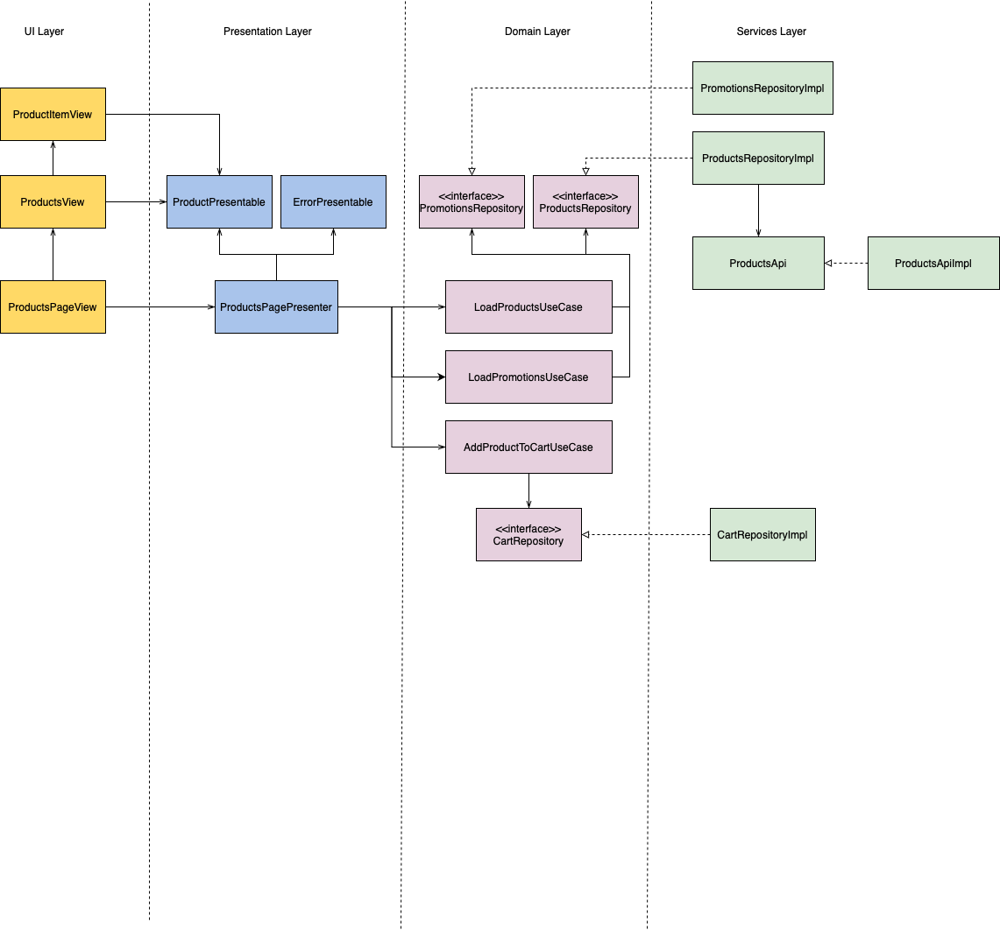
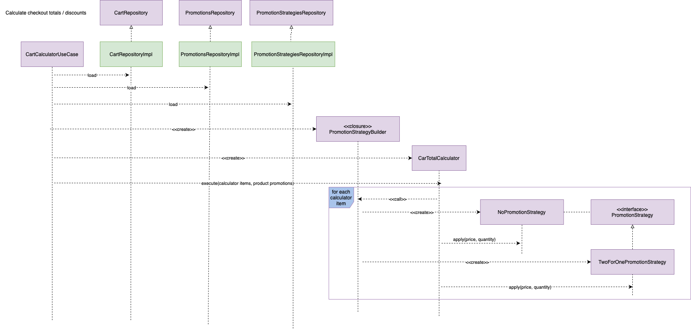

## Dev Enviorment
Mac M1 
MacOS Monterrey 12.6 
xCode 14.0.1 
Min Target iOS 16 
Testing device iPhone 13mini with iOS 16 

## Run the project
Open the project on xCode and run it. 
No external libraries were used, so it should run right away. 
You can also run the unit tests. 

## Which UI framework we can use.
UIKit or SwiftUI. Decided for SwiftUI to refresh concepts and today is almost the standard
for new projects.

## Which Application Architecture can we use.
We decided to follow the Clean Architecture recommendations. 
We will have a: 
* Main layer: application entry, composition of models.
* UI layer: mainly views, view utils.
* Presentation Layer: view logic, domain to view model mappings, 
* Domain Layer: bussiness logic with use cases and domain data models (anemic models), 
* Service Layer: repositories, apis.

## How will the feature be organized on the project structure.
We have the following options: 
1. Layer Packages->Feature Packages 
Best suitted for small teams and features.
2. Feature Packages->Layer Packages 
Best suitted when there are a resonable ammount of features but those features will be managed be the same team.
3. Feature Modules->Layer Packages 
Best suitted when the features of the app are managed by different teams.

We will choose number 1, the project has few features and only one Team member (me LOL).

## Which UI architechture can we use.
SwiftUI and Combine framework makes MVVM the preferred one.
On this project we are using a ViewModel just as data object that will hold formatted
data ready to display, Views will use this object. A Presenter holds any view logic and
builds a ViewModel from a Domain Model.

## How do we resolve the 'discounts are going to change frequently'.
We decided to go with a promotion strategy built from a promotion code. Then a promotion instance will use that promotion strategy to calculate the new price according. It is kind of strategy pattern.

If on the future we need to add a new promotion strategy then the use case than calculates the cart totals is not affected.

For a more flexible solution we should implement a kind of rules engine. This engine can interpret rules to apply by using an Iterpreter pattern.

## Application Architecture Exmaple diagrams.

## Improvements.
Better products api. 
We can manage enviorments setup by having one target and plist files with configurations (ex: base url) for each env. 
We can add a static code analyzer like SwiftLint. 
Only support for iPhone devices and portriat mode. 
No pagination support. Backend service does not provide pagination. 
Use string localization. 
Use a logging system for logging errors. 
Better cart UX, we can group the products and add a +/- buttons to update the quanity. 
